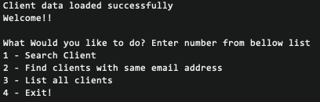

# Managing Client Data using Ruby 

## Ruby Installation
* Mac Users <br>
Ruby can be installed using 'brew'. Open terminal and type,

```shell
brew install ruby
```

To confirm ruby is installed type

```shell
ruby --version
```

* Windows Users <br>
Ruby installer can be used to install ruby. Go to following link to download.<br>
https://rubyinstaller.org/

## Features
* Search clients by passing clients names or partially matching name  <br>
* Find duplicate entries from data sets  <br>
* Exporting duplicated entries if needed  <br>
* Listing all available clients  <br>

## Lets get started
This is a simple command line application for manipulating given 'json' data set<br>

Clone this branch to your local machine. Please refer to 'Gemfile' for dependencies required<br>

To start the application type following command inside your project directory: <br>

```shell
ruby app.rb
```
Congratulation! You have successfully started the application. As you can see in bellow image, 
Application has successfully loaded data client data set. <br>

You can select from option 1 - 4 for the relevant action you need.


